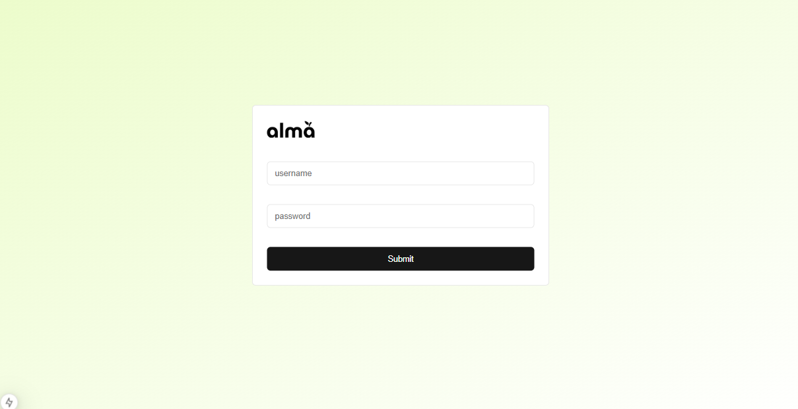
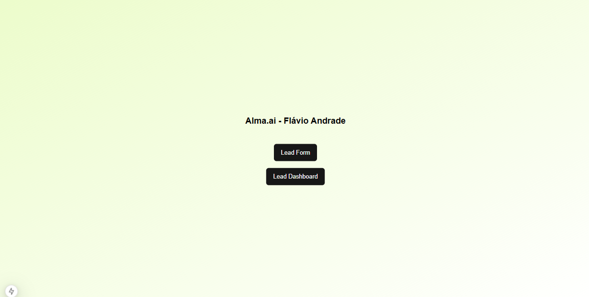
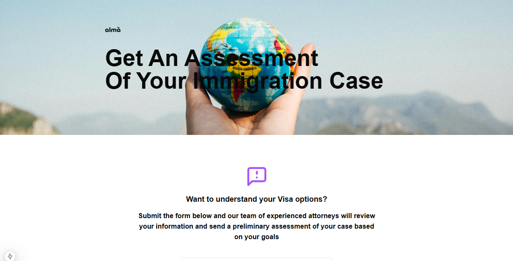
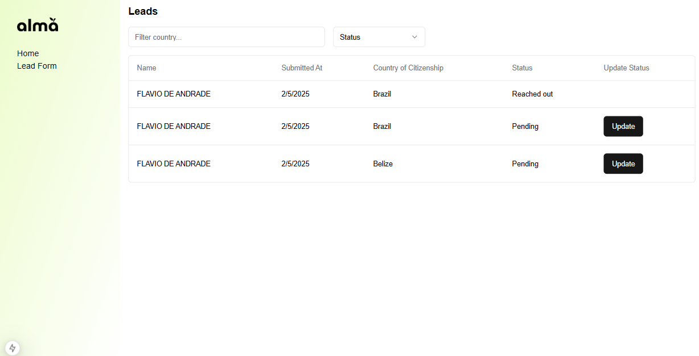

## Alma.ai - Flavio Andrade

First, run the development server:

```bash
npm i
# to install all the project dependencies and then
npm run dev
# to run the project locally
```

Open [http://localhost:3000](http://localhost:3000) with your browser to see the result.

For auth/signin/
Username = admin
Password = admin


## Tech Choises

- NextJS
- Mocked API with NextJS API
- Authentication with Next-Auth
- Data Storage with Prisma
- File upload applied and persistend on database
- Reack-hook-form used instead of JsonForms, due to not enough time to be confident using JsonForms
- No State Managemente needed, but Context API would be my choice
- Typescript and responssiveness applied
- No unit tests or functionalities, due to timeline

## Flow

HOME

LEAD FORM

LEAD DASHBOARD

SIGN IN

